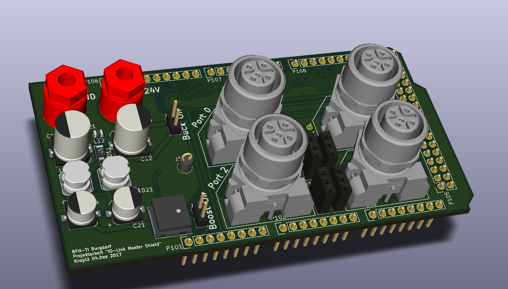
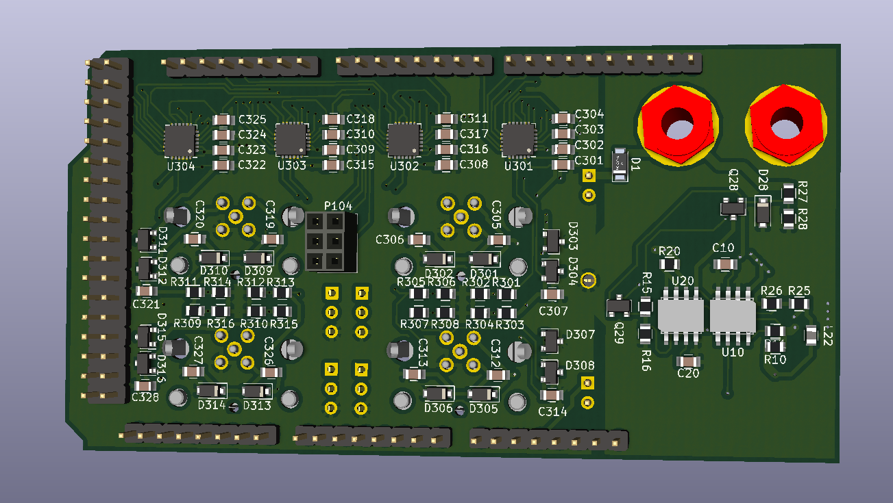

# IO-Link-Shield

Das IO-Link-Shield für Arduino wurde an der BFH  im Rahmen einer Projektarbeit erarbeitet. 
Dieses Repository enthällt alle wichtigen Daten zum Projekt. 

Die Dokumentation ist im Ordner Dokumente zu finden

[Bericht_io-Link Shield](https://github.com/LukasKropf/IO-Link-Shield/blob/master/Dokumente/Bericht_IO-Link%20Shield.pdf)

# Weiterführende Arbeiten:

Einige Zeit später wurde ein Nachfolgeprojekt gestartet in Rahmen einer Bachelorthesis.

[IO-Link Master Shield/Hat für Arduino und Raspberry Pi](https://bfh.easydocmaker.ch/search/abstract/2056/)

https://github.com/openiolink/io-link-master-shield-hat-sw

# Bilder

Hier einige Renderings:

